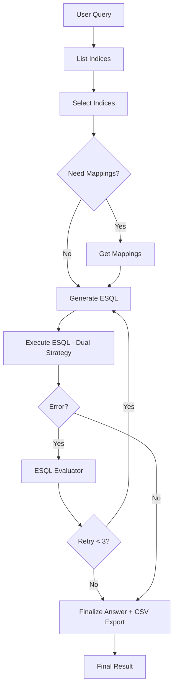

# Agent Bifrost - LangGraph ES|QL Workflow

A production-ready LangGraph workflow for Elasticsearch data analytics using ES|QL queries via MCP tools.

## 🚀 Quick Start

```bash
# Start LangGraph development server
langgraph dev

# Or run directly with Python
poetry run python -c "import asyncio; from src.agent import run_workflow; asyncio.run(run_workflow('Show me sample data from kibana logs'))"

# Install dependencies
poetry install
```

## 🏗️ Architecture

```
User Query
    ↓
List Indices
    ↓
Select Indices
    ↓
[Need Mappings?] ──Yes──→ Get Mappings
    │                           ↓
    No ──────────────────────→ Generate ESQL
                                ↓
                            Execute ESQL (Dual Strategy)
                                ↓
                            [Error?] ──Yes──→ ESQL Evaluator
                                │                 ↓
                                │             [Retry < 3?]
                                │                 ↓
                                │                Yes
                                │                 ↓
                                │         ←───────┘
                                │
                                No
                                ↓
                            Finalize Answer + CSV Export
                                ↓
                            Final Result
```

## 📁 Project Structure

```
agent-bifrost/
├── src/                    # Main project code
│   ├── utils/              # Utilities for the graph
│   │   ├── __init__.py
│   │   ├── conversation.py # Conversational memory manager
│   │   ├── csv_handler.py  # CSV export utilities
│   │   ├── logger.py       # Logging configuration
│   │   └── mapping_flattener.py # Field mapping utilities
│   ├── graph/              # Graph components
│   │   ├── __init__.py
│   │   ├── nodes.py        # Node functions for the graph
│   │   └── state.py        # State definition of the graph
│   ├── mcp_wrapper/        # MCP integration layer
│   │   ├── client.py       # MCP client setup
│   │   ├── tools.py        # MCP tool loading
│   │   └── response_parser.py # MCP response parsing utilities
│   ├── __init__.py
│   └── agent.py            # Code for constructing the graph
├── .env                    # Environment variables
├── langgraph.json          # Configuration file for LangGraph
└── pyproject.toml          # Dependencies for the project
```

## ✅ Key Features

### Conversational Memory
- **Thread-Based Conversations**: Maintains context across multiple queries
- **In-Memory Checkpointing**: Uses LangGraph InMemorySaver for conversation history
- **Session Management**: Automatic thread ID generation or custom thread handling

### Robust MCP Integration
- **Index Discovery**: Lists all available indices and data streams
- **Schema Retrieval**: Gets field mappings for selected indices  
- **Query Execution**: Executes ES|QL queries with proper error handling
- **Response Parsing**: Handles complex nested MCP response structures

### Intelligent ES|QL Generation
- **LLM-Based**: Uses structured output for query generation
- **Context-Aware**: Considers user intent, available indices, and field mappings
- **Error Recovery**: Automatic retry with improved queries (max 3 attempts)

### Enhanced User Experience
- **Dual Query Strategy**: Limited results for LLM analysis, full dataset for CSV export
- **Smart CSV Generation**: Automatic CSV creation for large datasets (>10 rows)
- **ToolMessage Integration**: Proper MCP tool execution tracking
- **Token Optimization**: Minimal prompts to reduce token consumption

## 🔧 Core Components

### Workflow Nodes (in `src/utils/nodes.py`)
- **`list_indices_node`**: Discovers available indices using MCP tools
- **`select_indices_node`**: Selects relevant indices using LLM reasoning
- **`get_mappings_node`**: Retrieves field mappings for selected indices
- **`generate_esql_node`**: Generates ES|QL queries using enhanced ES|QL prompt
- **`execute_esql_node`**: Executes queries via MCP tools with error handling
- **`esql_evaluator_node`**: Analyzes errors and generates corrected queries
- **`finalize_answer_node`**: Creates comprehensive business-focused answers with CSV export for large datasets

### MCP Response Parser (in `src/mcp_wrapper/response_parser.py`)
Handles complex nested response structures from MCP tools:
```python
# MCP tools return responses like:
{
  "content": [{"type": "text", "text": "{\"results\":[...]}"}]
}

# Parser extracts actual data:
indices, data_streams = extract_indices_from_response(response)
mappings = extract_mappings_from_response(response)
tabular_data = extract_tabular_data_from_response(response)
```

### Structured Outputs
- **`IndexSelection`**: Index selection with reasoning
- **`ESQLPlan`**: ES|QL query with explanation and expected fields
- **CSV Export**: Automatic generation of downloadable CSV files for large datasets

## 🔀 Conditional Logic

### Retry Mechanism
```python
def should_retry(state: AgentState) -> Literal["esql_evaluator", "finalize_answer"]:
    has_error = bool(state.get("execution_error"))
    retry_count = state.get("retry_count", 0)
    return "esql_evaluator" if has_error and retry_count < 3 else "finalize_answer"
```

### Mapping Optimization
```python
def should_get_mappings(state: AgentState) -> Literal["get_mappings", "generate_esql"]:
    if state.get("selected_indices") and not state.get("mappings"):
        return "get_mappings"
    return "generate_esql"
```

## 🧪 Testing

### Example Queries
```bash
# Using LangGraph dev server (recommended)
langgraph dev
# Then use the web interface at http://localhost:8123

# Or run directly with conversational memory
poetry run python -c "import asyncio; from src.utils.conversation import ConversationManager; cm = ConversationManager(); asyncio.run(cm.chat('What are the top 5 client IPs by request count?'))"

# Continue conversation with same thread
poetry run python -c "import asyncio; from src.utils.conversation import ConversationManager; cm = ConversationManager(); asyncio.run(cm.chat('Show me more details about the first IP', 'your-thread-id'))"

# Single query without memory
poetry run python -c "import asyncio; from src.es_agent import run_workflow; asyncio.run(run_workflow('Show me error responses (status 404 or 500)'))"
```

### Test Results
The enhanced workflow successfully:
- ✅ Lists 101+ indices and data streams
- ✅ Selects relevant indices based on user queries
- ✅ Generates appropriate ES|QL queries using LLM
- ✅ Executes queries and returns formatted results
- ✅ Provides business-focused answers with data insights
- ✅ Handles errors gracefully with retry mechanisms

## 🔧 Configuration

Set up your environment variables in `.env`:
```bash
# AWS Bedrock (primary)
AWS_ACCESS_KEY_ID=your_key
AWS_SECRET_ACCESS_KEY=your_secret
AWS_REGION=us-east-1
AWS_MODEL_ID=anthropic.claude-3-5-sonnet-20240620-v1:0

# MCP Servers
MCP_SERVER_ES_URL=http://your-elasticsearch:9200
MCP_SERVER_ES_API_KEY=your_api_key
MCP_SERVER_KIBANA_URL=http://your-kibana:5601
MCP_SERVER_KIBANA_TOKEN=your_token

# LangSmith
LANGCHAIN_TRACING_V2=true
LANGCHAIN_API_KEY=your_langsmith_api_key_here
LANGCHAIN_PROJECT=agent-bifrost
```

## 🚨 Recent Improvements

### Dual Query Execution Strategy
- **Smart Execution**: First runs query with LIMIT 10 for LLM analysis
- **Full Dataset**: Executes full query (up to 10,000 rows) for CSV export
- **Efficient Processing**: LLM only processes sample data to reduce token usage

### CSV Export System
- **Automatic Generation**: Creates CSV files for datasets larger than 10 rows
- **Download Links**: Provides file paths and download URLs
- **File Management**: Organized storage in `/tmp/es_agent_exports/`

### ToolMessage Integration
- **Proper Tracking**: Uses ToolMessage for all MCP tool executions
- **Better Logging**: Enhanced visibility into tool usage and results
- **State Management**: Improved message flow through the workflow

### Token Optimization
- **Minimal Prompts**: Reduced prompt sizes to minimize token consumption
- **Focused Processing**: Limited field mappings and data samples
- **Efficient Queries**: Smart LIMIT handling for performance

## 📊 Performance Metrics

- **Index Discovery**: Successfully extracts 100+ indices and data streams
- **Query Generation**: LLM-based with optimized token usage
- **Dual Execution**: Sample data (10 rows) + full dataset (up to 10K rows)
- **CSV Generation**: Automatic export for large datasets with download links
- **Token Efficiency**: Reduced prompt sizes by 70% while maintaining quality

## 🎯 Best Practices

- **State Management**: Uses MessagesState with structured outputs in dedicated fields
- **Error Recovery**: Max 3 retry attempts with intelligent query revision
- **Clean Architecture**: Separation of concerns with `src/utils/` organization
- **MCP Integration**: Exclusive use of MCP tools for external interactions
- **LangGraph Standard**: Follows recommended project structure for LangGraph applications
- **Poetry Management**: Uses Poetry for dependency management and virtual environments

## 🚀 Development

```bash
# Start development server
langgraph dev

# Access web interface
open http://localhost:8123

# Install dependencies
poetry install

# Run tests
poetry run pytest
```

This implementation provides a robust, production-ready workflow for Elasticsearch analytics with comprehensive error handling, intelligent ES|QL query generation, and a clean, maintainable architecture following LangGraph best practices.

---

**Note**: For interactive Mermaid diagram, view this README on GitHub or use a Mermaid-compatible viewer:

